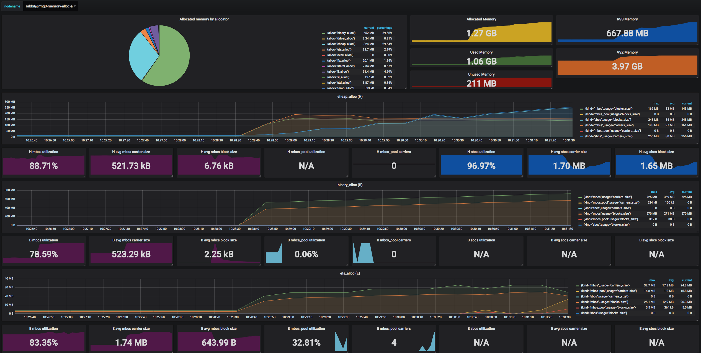

# BEAM Dashboards

A collection of Grafana dashboards for visualizing [Prometheus](https://github.com/deadtrickster/prometheus.erl) BEAM metrics.

- IRC: #erlang on Freenode;
- Slack: #prometheus channel - Browser or App(slack://elixir-lang.slack.com/messages/prometheus).

BEAM Dashboard:

BEAM Memory Allocators Dashboard:

Elli Dashboard:

Plugs/Phoenix/Ecto Dashboard:

## TODO

- RabbitMQ
